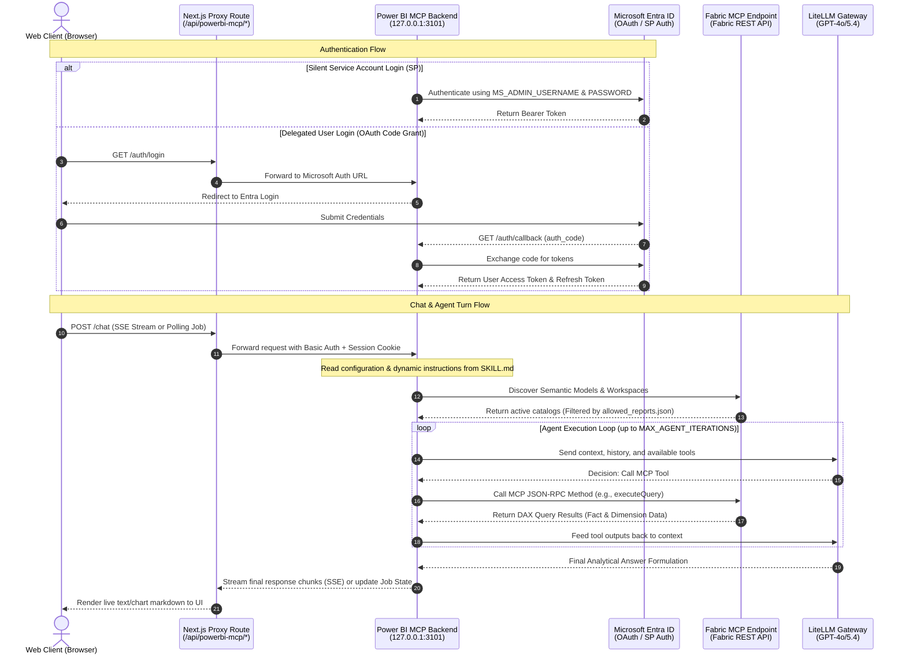

# 📊 Power BI MCP Analytics Service

An enterprise-grade, internal Node.js backend daemon designed to securely bridge modern Next.js applications with the **Microsoft Fabric / Power BI Model Context Protocol (MCP)** endpoint. It runs seamlessly as a background worker (e.g., under PM2), enabling intelligent, automated analytics, real-time agentic reasoning, and interactive data querying.

---

## 🏗️ Architectural Overview

The service acts as a secure intermediary layer, preventing the exposure of Power BI access tokens to the browser client and executing high-performance AI agent iterations close to the LLM gateway.



---

## ✨ Core Features

### 1. Robust Microsoft Entra ID Authentication Schemes
*   **Delegated User OAuth:** Supports standard multi-tenant or single-tenant authorization code grant flow. Manages user sessions securely using HTTP-only secure state cookies, automatic token refreshing (`sessionStore.js`), and clean logout flows.
*   **Silent Service Account / Service Principal Integration:** Auto-authenticates via resource owner password credentials flow when `MS_ADMIN_USERNAME` and `MS_ADMIN_PASSWORD` are configured. Eliminates prompt loops for web users, providing a seamless "zero-login" analytics experience.

### 2. Strict Security & Safety Guardrails
*   **Timing-Safe Local Gateways:** Uses Node.js `crypto.timingSafeEqual` to verify the `x-internal-api-key` header, blocking unauthorized internal network calls.
*   **Proxy-Authenticated Communication:** Configured to work in tandem with basic credentials authentication (`BASIC_AUTH_USER`/`BASIC_AUTH_PASSWORD`) when bridged by a local Next.js API layer.
*   **Allowed Catalog Boundary:** Filters discovered semantic models against a strict `allowed_reports.json` whitelist, guaranteeing that the AI agent has absolute zero exposure to unapproved datasets.

### 3. Agentic Loop with "Self-Inspection" & DAX Optimization
*   **OpenAI-Compatible Tool-Use Agent:** Orchestrates up to `MAX_AGENT_ITERATIONS` reasoning turns to perform multi-stage analytics, handle calculation retries, and format answers.
*   **Dynamic Instruction Injection:** Loads domain instructions directly from `SKILL.md` (e.g., KPI safety gates, measure-over-column enforcement, grain flag parsing) at runtime.
*   **Active DAX Inspection:** Uses system `INFO` queries to extract exact metric expressions directly from Fabric schemas to prevent hardcoding issues and metric hallucinations.

### 4. Interactive Telemetry & Reporting Loggers
*   **System Tracing:** Records detailed execution timelines to `logs/trace.jsonl` and formatted human-readable entries to `logs/trace-readable.log`.
*   **Usage Tracking:** Captures prompt details, system messages, final responses, token consumption, and agent iterations in `logs/usage.jsonl` and `logs/usage-readable.log` for cost and performance audits.

---

## 📂 Project Directory Structure

```text
powerbi-mcp/
├── .env.example              # Sample environment template
├── allowed_reports.json       # Whitelisted report names for semantic model filtering
├── ecosystem.config.js       # PM2 process daemon settings
├── package.json              # Script triggers and primary dependencies
├── SKILL.md                  # Strict runtime system prompt instructions for the AI
├── logs/                     # Execution and cost tracking records (auto-generated)
│   ├── trace.jsonl
│   ├── trace-readable.log
│   ├── usage.jsonl
│   └── usage-readable.log
└── src/                      # Backend Application Code
    ├── agent.js              # Multi-turn OpenAI-compatible reasoning agent loop
    ├── config.js             # Environment environment parsing and default rules
    ├── http.js               # Clean wrapper over node-fetch with configurable timeouts
    ├── mcpClient.js          # JSON-RPC Client for MS Fabric Model Context Protocol (MCP)
    ├── powerbiCatalog.js     # Automatic Workspace and Semantic Model Discovery (REST integrations)
    ├── security.js           # timingSafe basic auth and shared token middlewares
    ├── server.js             # Core Express server initializing routes & SSE streams
    ├── sessionStore.js       # MS AL Token Cache and cookie session serialization manager
    ├── traceLogger.js        # Detailed pipeline telemetry tracer
    └── usageLogger.js        # Token cost and prompt analytics log builder
```

---

## 🚦 Endpoint Directory & Routing Reference

All endpoints requiring **Basic Authentication** verify credentials against the configured `BASIC_AUTH_USER` and `BASIC_AUTH_PASSWORD`. Endpoints requiring an **Internal API Key** verify the `x-internal-api-key` header.

### Browser Session / Proxy Compatibility Layer (`/api/*`)

| Endpoint | Method | Required Auth | Response Format | Functional Description |
| :--- | :--- | :--- | :--- | :--- |
| `/api/auth/status` | `GET` | Basic Auth | `JSON` | Inspects whether the local session is authenticated, returning the username and active mode (`service-account` vs `delegated`). |
| `/api/auth/login` | `GET` | Basic Auth | `Redirect` | Automatically logs in using the Service Account, or redirects the user's browser to the Entra ID authorization endpoint. |
| `/api/auth/callback` | `GET` | None | `Redirect` | Processes the OAuth code callback from Microsoft, exchanges it for access tokens, sets session cookies, and redirects back. |
| `/api/auth/logout` | `GET` | Basic Auth | `JSON`/`Redirect` | Clears the active browser session and removes cookies. |
| `/api/mcp/tools` | `POST` | Basic + Session | `JSON` | Lists all available MCP tools provided by the Fabric endpoint. Accepts `{"refresh": true}` to force reload. |
| `/api/mcp/call` | `POST` | Basic + Session | `JSON` | Directly executes a specified MCP tool. Expects `{"name": "tool_name", "arguments": {}}`. |
| `/api/powerbi/catalog` | `POST` | Basic + Session | `JSON` | Returns whitelisted workspaces and semantic models. Supports forcing refresh. |
| `/api/chat` | `POST` | Basic + Session | `text/event-stream` | **Streaming Stream:** Initiates a live-streaming chat agent loop. Sends real-time chunk updates via SSE. |
| `/api/chat/start` | `POST` | Basic + Session | `JSON` (202 Accepted) | **Queued Polling:** Initiates an asynchronous agent turn. Returns a unique `jobId` for status polling. |
| `/api/chat/status` | `POST` | Basic + Session | `JSON` | Fetches the execution state and partial results of a queued job using `{"jobId": "..."}`. |
| `/api/chat/json` | `POST` | Basic + Session | `JSON` | Non-streaming agent query loop. Waits for complete resolution before returning payload. |

### Private Node-to-Node Server Layer (`/internal/*`)

These endpoints are designed for secure backend-to-backend communication, bypassing session cookies in favor of manual Bearer token pass-throughs.

| Endpoint | Method | Required Auth | Response Format | Functional Description |
| :--- | :--- | :--- | :--- | :--- |
| `/health` | `GET` | None | `JSON` | Basic service heartbeat, returning current uptime, LLM model, and MCP endpoint. |
| `/internal/mcp/tools` | `POST` | Internal Key + Bearer | `JSON` | Fetch available tools. Expects `Authorization: Bearer <user-token>`. |
| `/internal/mcp/call` | `POST` | Internal Key + Bearer | `JSON` | Executes a specific MCP tool method directly. |
| `/internal/powerbi/catalog` | `POST` | Internal Key + Bearer | `JSON` | Returns discovered semantic models whitelisted by local policies. |
| `/internal/chat` | `POST` | Internal Key + Bearer | `text/event-stream` | Streams real-time agent turns back to the parent server using SSE protocol. |
| `/internal/chat/start` | `POST` | Internal Key + Bearer | `JSON` | Queues a background analytics agent job, returning state identifiers. |
| `/internal/chat/status` | `POST` | Internal Key + Bearer | `JSON` | Checks progress of queued execution turns. |
| `/internal/chat/json` | `POST` | Internal Key + Bearer | `JSON` | Blocks and returns full analytical results as a single payload. |

---

## ⚙️ Environment Configuration

Create a `.env` file in the root directory. Below is a comprehensive list of all variables parsed by `src/config.js`:

| Key | Default Value | Category | Description |
| :--- | :--- | :--- | :--- |
| `PORT` | `3101` | Server | Local port on which the Express daemon listens. |
| `HOST` | `127.0.0.1` | Server | Network interface to bind. Recommended `127.0.0.1` for security. |
| `NODE_ENV` | `development` | Server | Set to `production` in live environments to restrict error payloads. |
| `BASIC_AUTH_USER` | `powerbi` | Security | Basic auth user string verified for `/api/*` proxy connections. |
| `BASIC_AUTH_PASSWORD` | `powerbi123` | Security | Basic auth password string verified for `/api/*` proxy connections. |
| `INTERNAL_API_KEY` | *Blank* | Security | Shared secret verified against `x-internal-api-key` for `/internal/*` routes. |
| `OPENAI_BASE_URL` | *Blank* | LLM Gateway | Custom endpoint URL for your LiteLLM or OpenAI-compatible router. |
| `OPENAI_API_KEY` | *Blank* | LLM Gateway | Bearer credential used to authenticate LLM requests. |
| `LLM_MODEL` | `openai/gpt-4o` | LLM Gateway | The exact target model name to prompt for reasoning. |
| `PBI_MCP_URL` | `https://api.fabric.microsoft.com/v1/mcp/powerbi` | MCP Fabric | Upstream Fabric MCP endpoint URL. |
| `MS_CLIENT_ID` | *Blank* | Azure Auth | Client ID of your registered Entra ID (Azure AD) application. |
| `MS_CLIENT_SECRET` | *Blank* | Azure Auth | Client secret for your registered Entra ID application. |
| `MS_TENANT_ID` | `common` | Azure Auth | Target Directory Tenant ID. Use `common` for multi-tenant setups. |
| `MS_ADMIN_USERNAME` | *Blank* | Azure Auth | Microsoft login username for the silent Service Account integration. |
| `MS_ADMIN_PASSWORD` | *Blank* | Azure Auth | Microsoft login password for the silent Service Account integration. |
| `MS_REDIRECT_URI` | `http://localhost:3000/auth/callback` | Azure Auth | Authorized redirect URI configured in your Azure App registration. |
| `FRONTEND_BASE_URL` | `http://localhost:3000` | Redirects | URL where your Next.js application is running. |
| `MAX_AGENT_ITERATIONS` | `8` | Tuning | Maximum tool-calling attempts the agent can take per question. |
| `MCP_CACHE_TTL_MS` | `600000` (10m) | Tuning | Cache lifetime for tools catalog and discovered workspaces. |
| `REQUEST_TIMEOUT_MS` | `150000` (150s) | Tuning | Hard timeout threshold for HTTP queries to Fabric and LLMs. |

---

## 🚀 Setup & Execution Guide

### 1. Installation

```bash
# Navigate to backend directory
cd powerbi-mcp

# Install required dependencies
npm install

# Initialize your configurations
cp .env.example .env
```

> [!IMPORTANT]
> Edit the newly created `.env` file and populate it with your LiteLLM credentials, Entra App client configuration, and whitelisted administrator accounts.

### 2. Lint & Health Checks

Perform high-performance syntax validation on all modules prior to starting:

```bash
npm run check
```

### 3. Local Development Run

Starts the service locally with Node's native hot-reloading file watcher enabled:

```bash
npm run dev
```

The service launches and prints current details:
```text
powerbi-mcp listening on http://127.0.0.1:3101
model: openai/gpt-5.4
mcp: https://api.fabric.microsoft.com/v1/mcp/powerbi
```

### 4. Production Deployment with PM2

Run the service in the background under PM2 process managers to ensure auto-restart and crash recovery:

```bash
# Start background worker daemon
pm2 start ecosystem.config.js

# Save settings across system reboots
pm2 save

# Review runtime status
pm2 status
```

---

## 🔗 Next.js Sibling App Integration

This service is optimized to work directly with a sibling Next.js application (`ads-next`). In the workspace, the drop-in client components live in:
`../powerbi-analyst-next-dropin/app`

### 1. Place Next.js Drop-in Routing Files
Copy the drop-in route handlers into your real Next.js application workspace:
*   `app/Power_BI_Analyst/page.tsx` (Main interactive interface component)
*   `app/api/powerbi-mcp/[...path]/route.ts` (Edge-compatible serverless proxy handler)

### 2. Configure Sibling Next.js Environment Variables
Add these key settings to your Next.js `.env.local` to bind with the background Express daemon:

```env
# URL to local Power BI MCP daemon
POWERBI_MCP_BACKEND_URL=http://127.0.0.1:3101

# Next.js basic auth proxy credentials
POWERBI_MCP_BASIC_AUTH_USER=powerbi
POWERBI_MCP_BASIC_AUTH_PASSWORD=powerbi123
```

### 3. Server-to-Server SSE Fetch Example

Here is a typical handler logic for streaming SSE tokens directly to a client interface using Node-to-Node `/internal` routes:

```typescript
const response = await fetch("http://127.0.0.1:3101/internal/chat", {
  method: "POST",
  headers: {
    "Content-Type": "application/json",
    "x-internal-api-key": process.env.POWERBI_MCP_INTERNAL_API_KEY,
    "Authorization": `Bearer ${userPowerBiAccessToken}`
  },
  body: JSON.stringify({
    message: "What are our total product ads impressions today?",
    history: []
  })
});

if (!response.body) throw new Error("Writable stream missing");

const reader = response.body.getReader();
const decoder = new TextDecoder();

while (true) {
  const { done, value } = await reader.read();
  if (done) break;
  
  const chunk = decoder.decode(value);
  console.log("SSE Packet Received:", chunk);
}
```

---

## 📊 Diagnostics, Telemetry, & Cost Audits

To audit queries, identify performance bottlenecks, and monitor LLM expenses, inspect the auto-generated files in `/logs`:

*   **`logs/trace-readable.log`**: A chronological record of API endpoints hits, tool-calls sequence execution time (in milliseconds), HTTP response statuses, and errors.
    ```text
    [2026-05-19T16:35:10.000Z] 4c3fb2d1 +120ms #3 agent.llm.done {"iteration":1,"toolCallCount":1}
    [2026-05-19T16:35:12.500Z] 4c3fb2d1 +2620ms #4 agent.tool.done {"iteration":1,"toolName":"executeQuery","resultBytes":4820}
    ```
*   **`logs/usage-readable.log`**: Visual dump of every prompt, user message, LLM system template, returned text response, and total token usage costs.
    ```text
    ================================================================================
    Timestamp        : 2026-05-19T16:35:15.000Z
    Request ID       : 4c3fb2d1
    Model Used       : openai/gpt-5.4
    Prompt Tokens    : 14502
    Completion Tokens: 382
    Total Tokens     : 14884
    Iterations       : 2
    
    User Message
    ------------
    Compare product Ads Daily impressions this week vs last week.
    
    Assistant Response
    ------------------
    Based on the "product Ads Daily" dataset...
    ```

---

## 🛡️ License and Security

This service runs strictly inside local firewalls or within private Virtual Private Networks (VPNs). **Never bind the server to public interfaces (`0.0.0.0`) in production without severe network restrictions or upfront gateways.**
